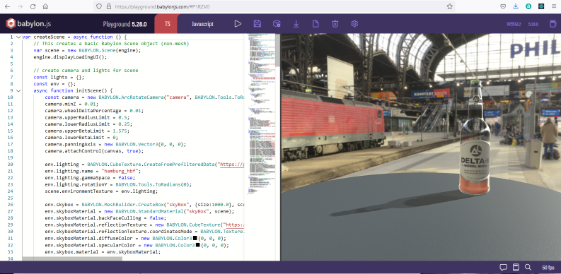
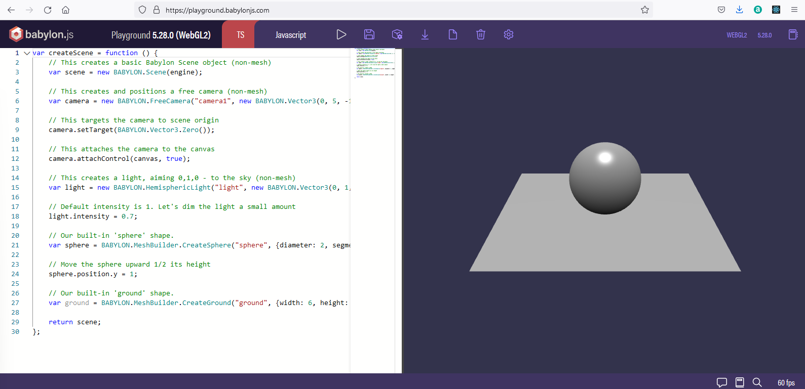

## Babyon introduction

The documentation for babylonjs is at [https://doc.babylonjs.com/journey](https://doc.babylonjs.com/journey).  This describes the first step.

The first piece of advice is then to open  second web page pointing at the babylon.js playground at [https://playground.babylonjs.com/](https://playground.babylonjs.com/).

The playground is a place where code snippets can be developed.  Each snippet created will have a unique identifier.  Appending this to the URL will allow you to access the saved snippet.  An example of a snippet which demonstrates the rendering capability of babylon js can be found at [https://playground.babylonjs.com/#P1RZV0](https://playground.babylonjs.com/#P1RZV0).  The code is displayed alongside the scene.  Possibly Hamburg station.  You can drag on the image in the playground to look around the 3D scene and notice refraction in the bottle and a partial transparent shadow.



## Default Scene

The default image on the playground site is a sphere floating above a ground plane.  The code displayed with this shows the createScene function.



The createScene function is the interesting thing here, but it is not the complete code.  Playground adds in extra code behind the scenes.  If you want to edit code in visual studio code you will need to add in the necessary standard code around the createScene function and all of this will need to sit inside an HTML file.

**hello.html**
```html
<!DOCTYPE html>
<html>
    <head>
        <meta http-equiv="Content-Type" content="text/html; charset=utf-8" />

        <title>Babylon.js sample code</title>

        <!-- Babylon.js -->
        <script src="https://cdnjs.cloudflare.com/ajax/libs/dat-gui/0.6.2/dat.gui.min.js"></script>
        <script src="https://assets.babylonjs.com/generated/Assets.js"></script>
        <script src="https://preview.babylonjs.com/ammo.js"></script>
        <script src="https://preview.babylonjs.com/cannon.js"></script>
        <script src="https://preview.babylonjs.com/Oimo.js"></script>
        <script src="https://preview.babylonjs.com/earcut.min.js"></script>
        <script src="https://preview.babylonjs.com/babylon.js"></script>
        <script src="https://preview.babylonjs.com/materialsLibrary/babylonjs.materials.min.js"></script>
        <script src="https://preview.babylonjs.com/proceduralTexturesLibrary/babylonjs.proceduralTextures.min.js"></script>
        <script src="https://preview.babylonjs.com/postProcessesLibrary/babylonjs.postProcess.min.js"></script>
        <script src="https://preview.babylonjs.com/loaders/babylonjs.loaders.js"></script>
        <script src="https://preview.babylonjs.com/serializers/babylonjs.serializers.min.js"></script>
        <script src="https://preview.babylonjs.com/gui/babylon.gui.min.js"></script>
        <script src="https://preview.babylonjs.com/inspector/babylon.inspector.bundle.js"></script>

        <style>
            html,
            body {
                overflow: hidden;
                width: 100%;
                height: 100%;
                margin: 0;
                padding: 0;
            }

            #renderCanvas {
                width: 100%;
                height: 100%;
                touch-action: none;
            }

            
        </style>
    </head>

    <body>
        <canvas id="renderCanvas"></canvas>
        <script src="/Block_3/top.js"></script>
        <script src="main.js"></script>
        <script src="/Block_3/bottom.js"></script>
    </body>
</html>
```

The script lines in the head load elements of the babylon.js library.  The full library can be loaded in a single line, however it is more efficient to add aspects individually so that only those sections of the library which are required for a scene are loaded.  This makes for a longer file to read, but a shorter download.

Below this some cascading stylesheet style is added and you are free to modify this.  The # sign indicates style which will only be applied to the single HTML element which has id="renderCanvas".

The `<body></body>` of the page is quite simple.  A `<canvas>` element will provide an area which can render an image described in WGL and this will be referenced by the unique identifier id="renderCanvas".

Below this are three sections of script.  Having these in separate files means that you can concentrate on the scene code in main.js while the other files have standard code which you can reuse.

The first script reads the DOM to store the renderCanvas into a javascript global variable "canvas".

A function is defined which will take an engine and this canvas as arguments and will render the scene when it is called.

Initial variables are set to null.

A function is defined which will create a babylon engine when it is called.

**top.js**
```JavaScript
var canvas = document.getElementById("renderCanvas");

var startRenderLoop = function (engine, canvas) {
    engine.runRenderLoop(function () {
        if (sceneToRender && sceneToRender.activeCamera) {
            sceneToRender.render();
        }
    });
};

var engine = null;
var scene = null;
var sceneToRender = null;
var createDefaultEngine = function () {
    return new BABYLON.Engine(canvas, true, {
        preserveDrawingBuffer: true,
        stencil: true,
        disableWebGL2Support: false,
    });
};
```

In the main section of the javascript a createScene function is defined which will return a constant scene object .  Features such as camera, light and shapes are added to the scene.

**main.js** 
```javascript
var createScene = async function () {
    const scene = new BABYLON.Scene(engine);
    scene.debugLayer.show();

    const camera = new BABYLON.ArcRotateCamera("camera", -Math.PI / 2, Math.PI / 2.5, 3, new BABYLON.Vector3(0, 0, 0));

    camera.attachControl(canvas, true);

    const light = new BABYLON.HemisphericLight("light", new BABYLON.Vector3(0, 1, 0));

    light.intensity = 0.7;

    const box = BABYLON.MeshBuilder.CreateBox("box", {});

    box.position.y = 3;

    var sphere = BABYLON.MeshBuilder.CreateSphere("sphere", { diameter: 2, segments: 32 }, scene);

    sphere.position.y = 1;

    var ground = BABYLON.MeshBuilder.CreateGround("ground", { width: 6, height: 6 }, scene);

    return scene;
};
```

So far functions and variables have been defined.  The last piece of code in bottom.js will initialise the page.

The async functions included here reflect the asynchronous nature of their operation.  The window.initFunction  defines and runs a function asyncEngineCreation() which calls the createDefaultEngine function which was defined in top.js.

Next a render loop is started with the engine and canvas passed as parameters and then a window.scene is created using createScene() defined in main.js.  When the asynchronous process is complete the returned scene will be stored in sceneToRender.

The last step allows the window to be resizeable.

**bottom.js**
```javascript
window.initFunction = async function () {
    var asyncEngineCreation = async function () {
        try {
            return createDefaultEngine();
        } catch (e) {
            console.log("the available createEngine function failed. Creating the default engine instead");
            return createDefaultEngine();
        }
    };

    window.engine = await asyncEngineCreation();
    if (!engine) throw "engine should not be null.";
    startRenderLoop(engine, canvas);
    window.scene = createScene();
};
initFunction().then(() => {
    scene.then((returnedScene) => {
        sceneToRender = returnedScene;
    });
});

// Resize
window.addEventListener("resize", function () {
    engine.resize();
});
    </script>
```

The resulting html page is then displayed.  The inspector and scene explorer are dynamic.  You can close them to see the full scene.  Note as well that the hamburger icon at the bottom of the left sidebar can be clicked to hide navigation links and view the full page.

<iframe 
    height="600" 
    width="100%" 
    scrolling="no" 
    title="Zdog trefoil" 
    src="Block_3/section_1/Hello/Hello.html" 
    frameborder="no" 
    loading="lazy" 
    allowtransparency="true" 
    allowfullscreen="true">
</iframe>


