## Using Docker

## The docker development environment

Docker setup has already been so run docker desktop and wait until it is fully running.  Sometimes I find it best to start docker before loading the machine with other applications such as code editors and browsers.  Whe whale icon in the system tray becomes static when the docker engine is running and the icon in docker dashboard turns from amber to green.

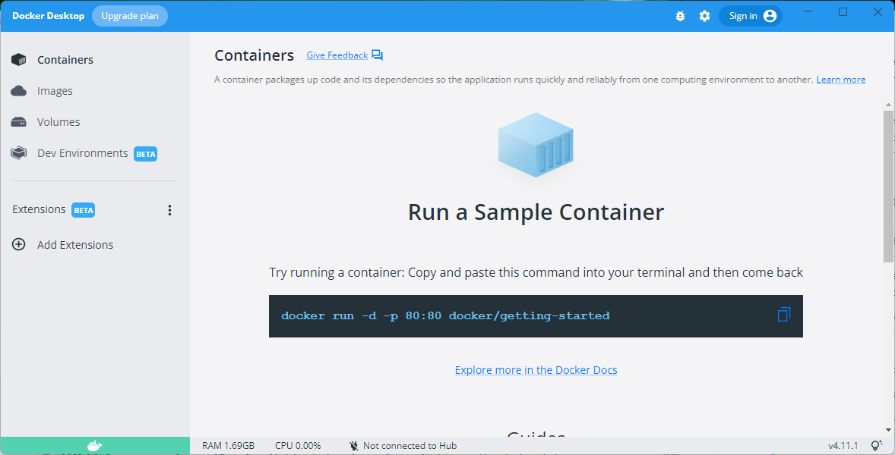

At the time of writing the current docker version is 4.11.1

If you want to run a sample container or look to see what tutorial materials are provided for docker take a brief detour before continuing.

## Running Babylon.js with Docker

Docker is good for development and deployment.  The development environment works well with github and visual studio code.

Containers need a more detailed knowledge of docker to use, but applications running in containers can be uploaded and run on many web services including [Heroku](https://www.heroku.com/deploy-with-docker), [Amazon Web Services](https://www.docker.com/partners/aws/), [Azure](https://azure.microsoft.com/en-gb/services/kubernetes-service/docker/) and [Digital Ocean](https://www.digitalocean.com/community/tutorials/what-is-docker)

Docker can be difficult at times and using it can seem to put a layer of code between you and your application under development.  However, docker has become so widely used that you should know it and its' benefits are worth the initial discomfort.

For this section I am going to use the docker development environment.  Although this is listed as Beta, it has been available for over a year and widely tested.

### Prepare github repository

Start by logging in to your github account online and creating a new repository.  The image shows a new repository named tictac you should provide your own name, I will use **babylonDev** in place of tictac.

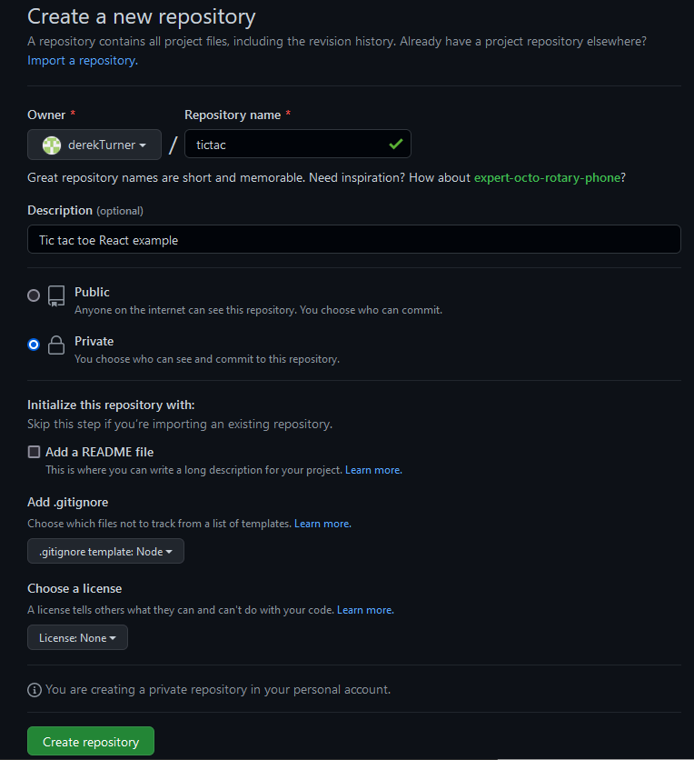

I have made my repository private, that does not matter too much, but it is important to add a .gitnore file choosing node from the drop down list of templates.


In the github browser, from the Add file button create a new file named **.docker/config.json** Take care not to omit the full stop before docker.

Add the text:

```json
{
    "image": "node"
}
```

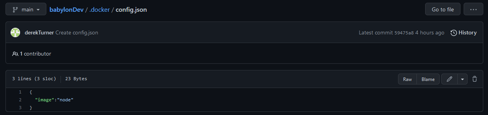

This is probably the simplest config file you could state and it just refers to the current version of node.

Scroll down and commit the new file.

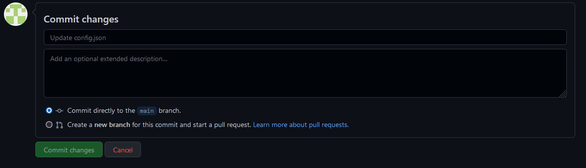

you now have two files and one folder in your repository.

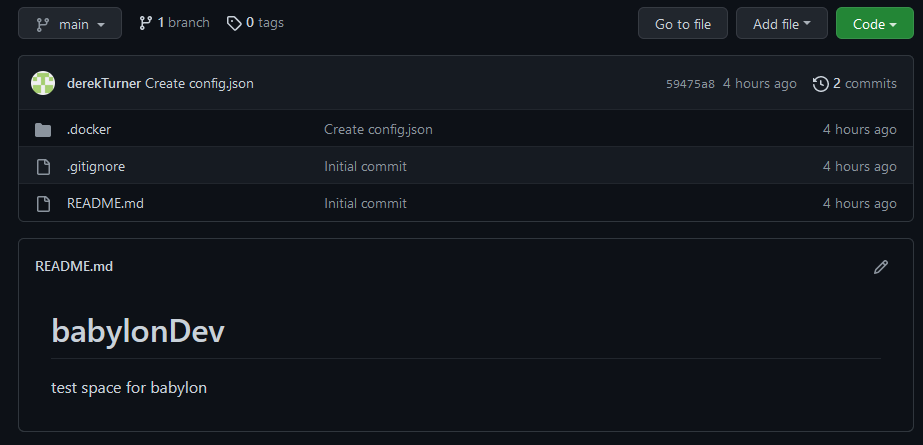

Now a docker environment will be created which is linked to the github site.  Code written on Docker will be stored to github.  That means Docker can be discarded and nothing is lost.  It is easy to open Docker fresh on a new machine and continue working.

### create a docker environment

Open the docker environment page and click to create a new environment.


Step one just lists some benefits of the environment.

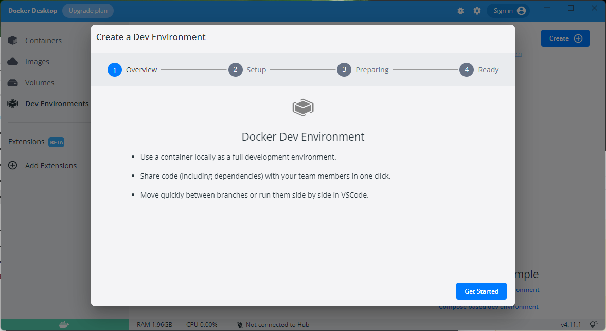

Click "Get started".

Enter the address of your own existing git repository. Following the pattern:
> https://github.com/yourName/babylonDev


Click "continue".


It takes a while to complete the preparation stage,  this involves downloading a linux environment with node from docker hub.  All this happens behind the scenes.

Docker will try to detect what language your repository is using, but we have not written any code yet so it can't succeed in that.


When the "preparing" message is replaced with "successful" click "continue".

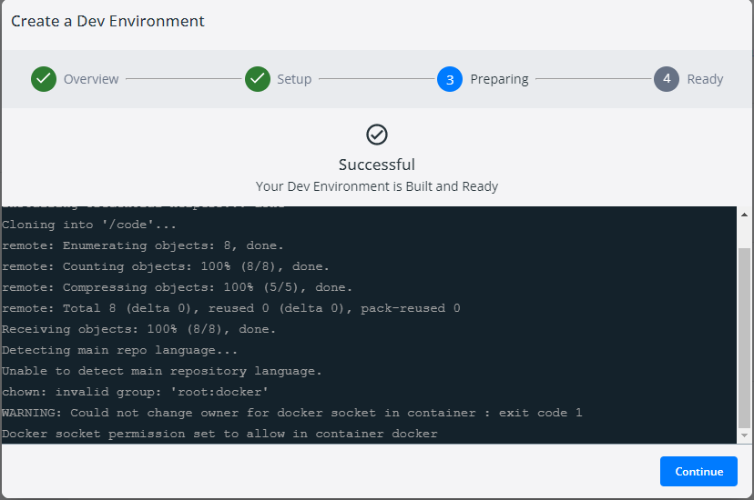

You should now be all set.  The development system will have some auto-generated names which will vary from mine, but they should still start with babylonDev.

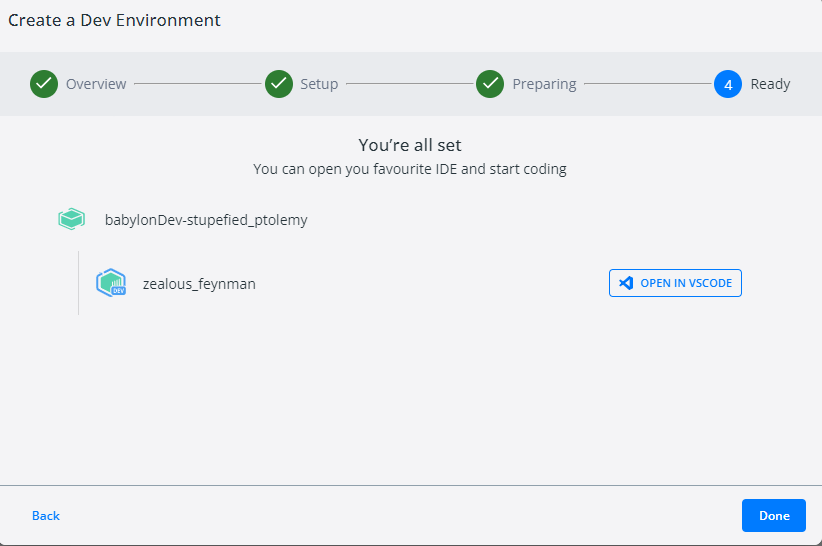

Click on "done".

You can now see the dev envoronments and if you hang the mouse to the right of the dev icon a button will appear and allow you to open in vscode.

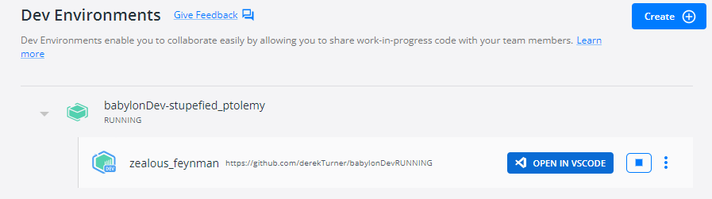

If you missed out any to the stages in the setup you will be prompted to install pre-requisites.  Once the setup is correct you should see your view of the container.

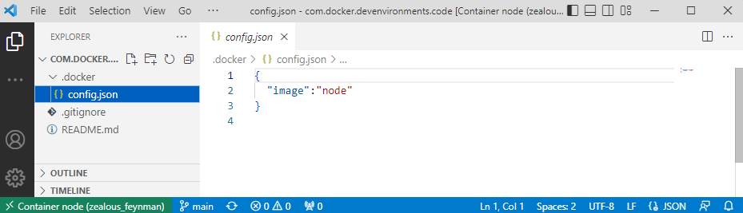

You can see the files you added to github and below these you have a bash shell (because you are now working inside a linux environment in the container).

If the bash shell does not appear you can open it by clicking on the the toggle layout CTRL + J button.

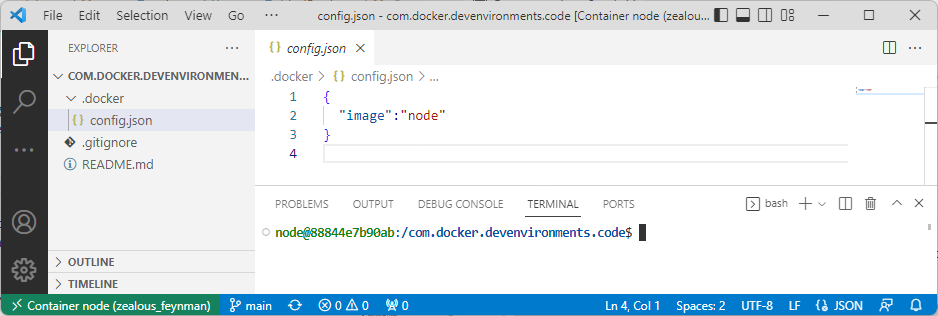

In the shell enter

>node@18a06ef076ee:/com.docker.devenvironments.code$ node --version

```code
v18.11.0
```
The most recent node version is used unless a different one is specified in the config file.

Check the file structure of the shell and see Linux folders and files.

> node@18a06ef076ee:/com.docker.devenvironments.code$ cd ..

>node@18a06ef076ee:/$ ls

```code
bin   com.docker.devenvironments.code  etc   lib    media  opt   root  sbin  sys  usr
boot  dev                              home  lib64  mnt    proc  run   srv   tmp  var
```

Try out some linux commands and refer to a [Linux command cheat sheet](https://phoenixnap.com/kb/linux-commands-cheat-sheet)

When you have had a look around move back to the com.docker.devenvironments.code folder and work on from there.

### Installing babylon

Returning to the development environment folder in the terminal you can now issue commands to install babylonjs.

Create folders src, dist, public and assets.


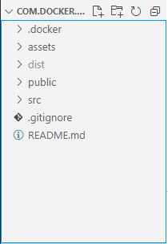

Run npn init 

> npm init

```code
This utility will walk you through creating a package.json file.
It only covers the most common items, and tries to guess sensible defaults.

See `npm help init` for definitive documentation on these fields
and exactly what they do.

Use `npm install <pkg>` afterwards to install a package and
save it as a dependency in the package.json file.

Press ^C at any time to quit.
package name: (com.docker.devenvironments.code) 
version: (1.0.0) 
description: babylonDev
entry point: (index.js) 
test command: test
git repository: (https://github.com/derekTurner/babylonDev) 
keywords: babylon
author: Derek Turner
license: (ISC) 
About to write to /com.docker.devenvironments.code/package.json:

{
  "name": "com.docker.devenvironments.code",
  "version": "1.0.0",
  "description": "babylonDev",
  "main": "index.js",
  "scripts": {
    "test": "test"
  },
  "repository": {
    "type": "git",
    "url": "git+https://github.com/derekTurner/babylonDev.git"
  },
  "keywords": [
    "babylon"
  ],
  "author": "Derek Turner",
  "license": "ISC",
  "bugs": {
    "url": "https://github.com/derekTurner/babylonDev/issues"
  },
  "homepage": "https://github.com/derekTurner/babylonDev#readme"
}


Is this OK? (yes) yes
```

A package json file is created which can be editted subsequintly.

```json
{
  "name": "com.docker.devenvironments.code",
  "version": "1.0.0",
  "description": "babylonDev",
  "main": "index.js",
  "scripts": {
    "test": "test"
  },
  "repository": {
    "type": "git",
    "url": "git+https://github.com/derekTurner/babylonDev.git"
  },
  "keywords": [
    "babylon"
  ],
  "author": "Derek Turner",
  "license": "ISC",
  "bugs": {
    "url": "https://github.com/derekTurner/babylonDev/issues"
  },
  "homepage": "https://github.com/derekTurner/babylonDev#readme"
}
```

Next install webpack and core Babylon.js libraries.

> npm install --save-dev webpack webpack-cli webpack-dev-server webpack-merge clean-webpack-plugin file-loader html-webpack-plugin source-map-loader url-loader eslint


> npm install @babylonjs/core

```code
added 1 package, and audited 444 packages in 6s

71 packages are looking for funding
  run `npm fund` for details

found 0 vulnerabilities
```

Then install additional Babylon.js modules for use:

> npm install --save-dev @babylonjs/materials @babylonjs/loaders @babylonjs/gui @babylonjs/procedural-textures @babylonjs/post-processes @babylonjs/serializers @babylonjs/inspector

```code
added 18 packages, and audited 462 packages in 22s

71 packages are looking for funding
  run `npm fund` for details

found 0 vulnerabilities
```
The installation of these dependancies is reflected in the update of package.json

```json
{
  "name": "com.docker.devenvironments.code",
  "version": "1.0.0",
  "description": "babylonDev",
  "main": "index.js",
  "scripts": {
    "test": "test"
  },
  "repository": {
    "type": "git",
    "url": "git+https://github.com/derekTurner/babylonDev.git"
  },
  "keywords": [
    "babylon"
  ],
  "author": "Derek Turner",
  "license": "ISC",
  "bugs": {
    "url": "https://github.com/derekTurner/babylonDev/issues"
  },
  "homepage": "https://github.com/derekTurner/babylonDev#readme",
  "devDependencies": {
    "@babylonjs/gui": "^5.28.0",
    "@babylonjs/inspector": "^5.28.0",
    "@babylonjs/loaders": "^5.28.0",
    "@babylonjs/materials": "^5.28.0",
    "@babylonjs/post-processes": "^5.28.0",
    "@babylonjs/procedural-textures": "^5.28.0",
    "@babylonjs/serializers": "^5.28.0",
    "clean-webpack-plugin": "^4.0.0",
    "eslint": "^8.25.0",
    "file-loader": "^6.2.0",
    "html-webpack-plugin": "^5.5.0",
    "source-map-loader": "^4.0.1",
    "url-loader": "^4.1.1",
    "webpack": "^5.74.0",
    "webpack-cli": "^4.10.0",
    "webpack-dev-server": "^4.11.1",
    "webpack-merge": "^5.8.0"
  },
  "dependencies": {
    "@babylonjs/core": "^5.28.0"
  }
}
```
To this add the following three scripts.  Start will allow webpack to serve in development mode.  Build will perform packing and lint will check for errors.

```json
"scripts": {
    "test": "test",
    "start": "npx webpack serve --mode development",
    "build": "npx webpack --mode production",
    "lint":  "npx eslint"
  },
```

Add a configuration file for eslint to the root folder of the repository named **.eslintignore** do not omit the initial full stop.  We want the linter to ignore the many node modules created and also not to try to error check the final distribution.

**.eslintignore**
```code
node_modules
dist
```

Virtual studio code adds an icon to indicate that the file type is recognised.

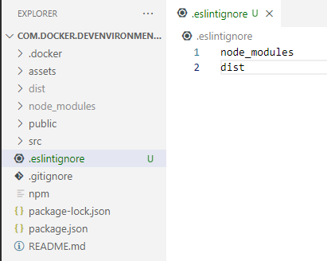

Commit these files and synchronise to github.

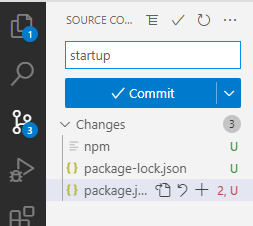

Give the commit a text message "startup" and click the commit button.

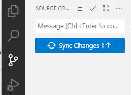

Synchronise the changes.

Your code is now safely backed up on github.

There is a bit more yet to do to get the application running!
---

